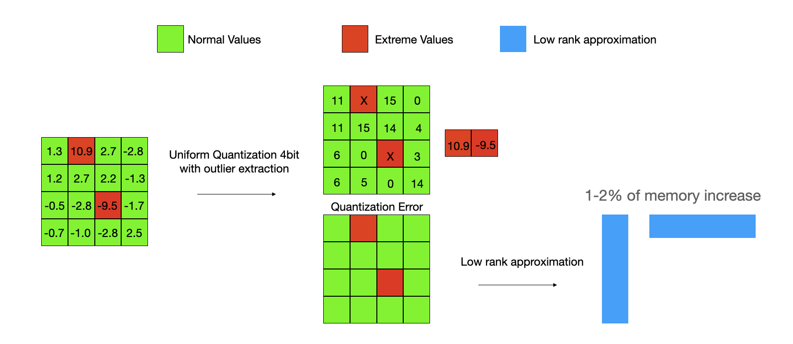

[](https://arxiv.org/pdf/2403.05527.pdf)
## GEAR: An Efficient KV Cache Compression Recipe for Near-Lossless Generative Inference of LLM #
<p align="center"></p><br/>

Official repo for `GEAR: An Efficient KV Cache Compression Recipe for Near-Lossless Generative Inference of LLM.` `GEAR` is a "plug-and-play" inference only KV quantization method.
`GEAR` augments any quantization scheme via an error recovery solution to boost the model accuracy while saving memory.

Here, `GEAR` is the abbreviation of `Ge`nerative Inference with LLM via `A`pproximation and Error `R`ecovery.


## Updates
- **March 8th, 2024**: Initial manuscript is submitted to arxiv!
- **March 11th, 2024**: Initial code release!
- **March 21th, 2024**： LongEval evaluation supported by GEAR!
## Overview
GEAR is an efficient KV cache compression framework that achieves
near-lossless high-ratio compression. GEAR first applies quantization to majority of entries of
similar magnitudes to ultra-low precision. It then employs a low-rank matrix to approximate
the quantization error, and a sparse matrix to remedy individual errors from outlier entries.

GEAR does not need to preserve any first or last tokens uncompressed like other low bit compression algorithms to achieve near lossless KV cache compression for LLMs.
<p align="center"></p><br/>

## How to use GEAR
```bash
conda create -n GEAR python==3.10
conda activate GEAR
pip install -r requirements.txt
```
### Example
```code
from GEARLM import GearLlamaForCausalLM
from transformers import AutoTokenizer
compress_config = {}
compress_config["compress_mode"] = "gear_batch" # batchwise-GEAR
compress_config["quantize_bit"] = 4 # outlier quantization bit
compress_config["left"] = 0.02 # outlier extraction rate
compress_config["rank"] = 0.02  # setting rank for Key and value cache quantization error
compress_config["loop"] = 3 # a constant for power iteration(an efficient SVD solver)
compress_config["stream"] = True # streaming-gear set to true to perform better efficiency
compress_config["streaming_gap"] = 20 # re-compress every 20 iteration 
model = GearLlamaForCausalLM.from_pretrained(
    "meta-llama/Llama-2-7b-hf",
    cache_dir="../cache",
    device_map=device_map,
    compress_config=compress_config,
    torch_dtype=torch.float16,
    # torch_dtype = torch.float16,
)
tokenizer = AutoTokenizer.from_pretrained(
    "meta-llama/Llama-2-7b-hf",
    token=None,
    padding_side="left",
    model_max_length=max_length,
    use_fast=False,
    cache_dir="../cache",
    max_length=max_length,
)
...
```
### Reposity architecture
```
.
├── Fig
├── GEARLM
├── GenerationBench
├── Readme.md
├── TrueCompressionLlaMA
├── lm-harness
└── requirements.txt
```
`GEARLM` is the source code of python package

`GenerationBench` is simluated compression tested on finetuned and un finetuned model with BBH, GSM8K, and MMLU dataset.

`TrueCompressionLlaMA` are Llama-2 embeded with GEAR true compression code on an old version of transformers and a new version of transformers.

`lm-harness` is simluated compression tested on LLaMA-2 7B
## Developers

- [Hao Kang*](https://haokang-timmy.github.io/)(Georgia Tech)
- [Qingru Zhang*](https://www.linkedin.com/in/qingru-zhang-4b789a187/)(Georgia Tech)
- [Souvik Kundu](https://ksouvik52.github.io/)(Intel)
- [Geonhwa Jeong](https://ghjeong12.github.io/)(Georgia Tech)
- [Zaoxing Liu](https://zaoxing.github.io/)(University of Maryland)
- [Tushar Krishna](https://www.linkedin.com/in/tushar-krishna-a60b0970/)(Georgia Tech)
- [Tuo Zhao](https://www2.isye.gatech.edu/~tzhao80/)(Georgia Tech)


## Citation
[link to paper](https://arxiv.org/pdf/2403.05527.pdf)
```
@misc{kang2024gear,
      title={GEAR: An Efficient KV Cache Compression Recipe for Near-Lossless Generative Inference of LLM}, 
      author={Hao Kang and Qingru Zhang and Souvik Kundu and Geonhwa Jeong and Zaoxing Liu and Tushar Krishna and Tuo Zhao},
      year={2024},
      eprint={2403.05527},
      archivePrefix={arXiv},
      primaryClass={cs.LG}
}
```
## Contributing
We are welcoming everyone to contribute to this reposity by rasing PRs. If there is any problem you may also shot email to hkang342@gatech.edu.
